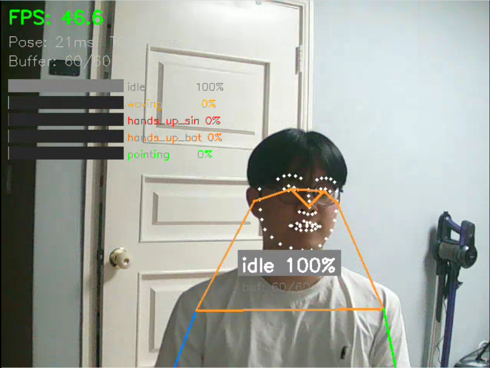
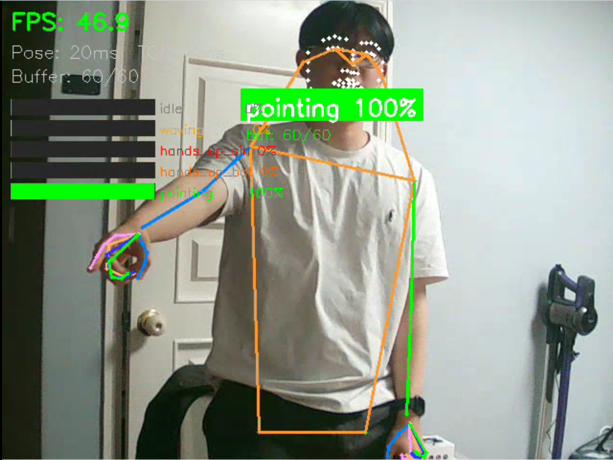
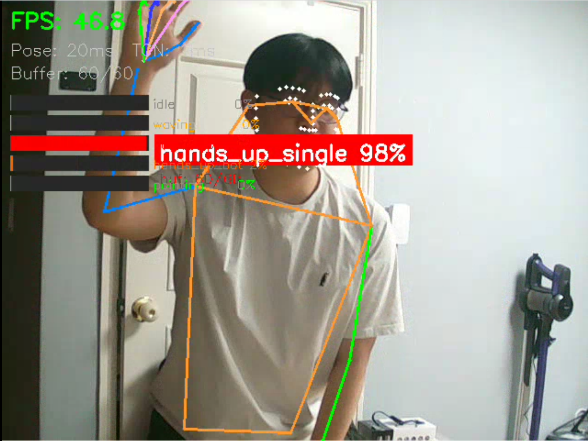
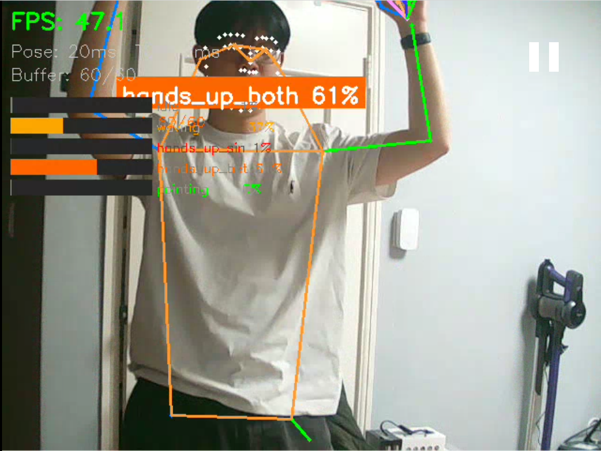
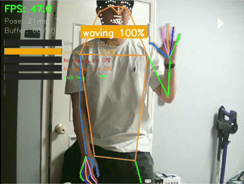

# Skeleton-based Action Recognition

스켈레톤 기반 행동/자세 인식 프로젝트.  
**Posture Recognition** (MLP) + **Gesture Recognition** (TCN) 두 개의 파이프라인으로 구성됩니다.

rtmlib Wholebody(133 keypoints) → 스켈레톤 추출 → 학습 → 실시간 추론

<table>
  <tr>
    <td width="50%" align="center"><br/><b>Idle</b></td>
    <td width="50%" align="center"><br/><b>Pointing</b></td>
  </tr>
  <tr>
    <td width="50%" align="center"><br/><b>Hand Up (Single)</b></td>
    <td width="50%" align="center"><br/><b>Hand Up (Both)</b></td>
  </tr>
</table>

<p align="center">
  <br/>
  <b>Waving</b>
</p>

---

## 클래스 구성

### Posture Recognition (MLP) — 단일 프레임

| Label | 이름 | 데이터 |
|-------|------|--------|
| 0 | sitting | POLAR dataset |
| 1 | standing | POLAR dataset |
| 2 | lying | POLAR dataset |

### Gesture Recognition (TCN) — 시퀀스 (65-joint wholebody)

| Label | 이름 | 데이터 |
|-------|------|--------|
| 0 | idle | 커스텀 수집 |
| 1 | waving | 커스텀 수집 |
| 2 | hands_up_single | 커스텀 수집 |
| 3 | hands_up_both | 커스텀 수집 |
| 4 | pointing | 커스텀 수집 |

---

## 프로젝트 구조

```
├── data/
│   ├── dataset.py              # MLP 데이터셋 (단일 프레임, Posture)
│   ├── ntu_dataset.py          # TCN 데이터셋 (시퀀스, Gesture)
│   ├── collect_skeleton.py     # 이미지 → 스켈레톤 추출
│   ├── Annotations/            # POLAR JSON 어노테이션
│   ├── ImageSets/              # train/val split 파일
│   ├── images/                 # 원본 이미지 (gitignore)
│   ├── skeletons/              # 추출된 .npy (gitignore)
│   └── dataset/                # 커스텀 비디오 클립 (gitignore)
├── models/
│   ├── mlp.py                  # MLP 모델 (Posture)
│   ├── tcn.py                  # TCN 모델 (Gesture, Dilated Causal Conv)
│   ├── best_model.pth          # 학습된 MLP (gitignore)
│   ├── best_tcn_xsub.pth       # 학습된 TCN (gitignore)
│   └── best_tcn_xset.pth       # 학습된 TCN (gitignore)
├── src/
│   ├── train.py                # MLP 학습
│   ├── train_tcn.py            # TCN 학습
│   ├── val.py                  # MLP 평가
│   ├── val_tcn.py              # TCN 평가
│   ├── inference.py            # MLP 추론 (.npy / 웹캠)
│   ├── inference_tcn.py        # TCN 실시간 추론 (웹캠)
│   └── collect_data.py         # 웹캠 데이터 수집 도구
├── utils/
│   ├── skeleton_ops.py         # 스켈레톤 joint 연산 (17/65-joint)
│   ├── normalize_skeleton.py   # 어깨 기반 정규화
│   └── compute_pairwise_distance.py  # Bone distance 피처
├── extract_wholebody_skeleton.py   # 비디오 → 65-joint pkl 추출
├── extract_ntu_subset.py           # NTU120에서 subset 추출
├── merge_pkl.py                    # NTU + 커스텀 pkl 병합
├── requirements.txt
└── README.md
```

---

## 환경 설정

```bash
pip install -r requirements.txt
```

[rtmlib](https://github.com/Tau-J/rtmlib)가 별도 경로에 설치되어 있어야 합니다.

---

## 스켈레톤 구조 (65-joint, face 제거)

RTMPose Wholebody 133 keypoints에서 **face 68개를 제거**한 65-joint:

| 구간 | 인덱스 | 갯수 |
|------|--------|------|
| Body (COCO) | 0-16 | 17 |
| Feet | 17-22 | 6 |
| Left Hand | 23-43 | 21 |
| Right Hand | 44-64 | 21 |
| **합계** | | **65** |

TCN 입력: `(batch, 130, T)` — 65 joints × 2 coords, T = 시퀀스 길이

---

## 사용법

### 1. 데이터 준비

#### 커스텀 비디오 → 65-joint 스켈레톤 추출

```bash
python extract_wholebody_skeleton.py
```

`data/dataset/` 아래의 비디오에서 65-joint 스켈레톤을 추출하여 `wholebody_5class.pkl` 생성.

#### NTU-120 subset 추출 (선택)

```bash
python extract_ntu_subset.py --src /path/to/ntu120_2d.pkl
python merge_pkl.py --ntu ntu_5class.pkl --custom wholebody_5class.pkl
```

### 2. 학습

#### TCN (Gesture, 5-class)

```bash
python src/train_tcn.py --pkl wholebody_5class.pkl --split xsub --epochs 100
```

| 옵션 | 기본값 | 설명 |
|------|--------|------|
| `--pkl` | `merged_5class.pkl` | 학습 데이터 pkl |
| `--split` | `xsub` | 분할 (xsub / xset) |
| `--epochs` | 100 | 학습 에폭 |
| `--batch_size` | 32 | 배치 크기 |
| `--lr` | 1e-3 | 학습률 |
| `--patience` | 15 | Early stopping |
| `--max_frames` | 120 | 최대 시퀀스 길이 |

#### MLP (Posture, 3-class)

```bash
python src/train.py
```

### 3. 평가

```bash
python src/val_tcn.py --pkl wholebody_5class.pkl --split xsub_val
python src/val.py
```

### 4. 실시간 추론

#### Gesture (TCN) — 웹캠

```bash
python src/inference_tcn.py
python src/inference_tcn.py --source video.mp4
python src/inference_tcn.py --source image.jpg
```

| 키 | 동작 |
|----|------|
| q | 종료 |
| r | 버퍼 초기화 |

#### Posture (MLP) — 웹캠

```bash
python src/inference.py --webcam
python src/inference.py --webcam --source video.mp4
python src/inference.py skeleton.npy    # .npy 파일 추론
```

## 제공해주는 데이터셋 및 모델

### DataSet
|data structure| 링크|
|---|---|
|Only Skeleton|[Skeleton Download Link](https://drive.google.com/file/d/1b7dn6unjZZlvGphD1HsmhofyoLXEiqyp/view?usp=sharing)|
|All Video|[Video Download link](https://drive.google.com/file/d/1b7dn6unjZZlvGphD1HsmhofyoLXEiqyp/view?usp=sharing)|

### Pretrained model

| model | 링크 |
|----|----|
|MLP|[MLP Download Link](https://drive.google.com/file/d/1Prnip7Zo3Brh01LBdNcXS_PHi1OCp3Gt/view?usp=drive_link)|
|TCN|[TCN Download Link](https://drive.google.com/file/d/1mNUcOMt5AlNlY6JNDcyVvuuUfQ97LW7E/view?usp=drive_link)|

---

## 모델 아키텍처

### TCN (Temporal Convolutional Network)
- Dilated causal convolution (dilation: 1→2→4→8)
- Residual connections + BatchNorm + Dropout
- Masked global average pooling → FC classifier
- 입력: `(B, 130, T)` — 65 joints × 2

### MLP
- 3-layer FC (256→128→3)
- 입력: 50-dim (17 joints × 2 + 16 bone distances)

### 정규화
- 어깨 중점 이동 → 어깨 거리 스케일링 → low confidence zeroing

## 학습 결과

### Posture MLP
||precision|recall|F1 score|
|---|---|---|---|
|standing|0.9532|0.9082|0.9302|
|sitting|0.8383|0.8879|0.8624|
|lying|0.7382|0.8446|0.7848|

### Gesture TCN
||precision|recall|F1 score|
|---|---|---|---|
|idle|1.0|1.0|1.0|
|waving|1.0|0.9667|0.9831|
|handup_single|0.9661|0.9500|0.9580|
|handup_both|0.9836|1.0|0.9917|
|pointing|0.9677|1.0|0.9836|


## TODO
위의 추론 영상과 같이 가까운 시점과 7~8m 넘어가는 지점부터의 데이터셋이 없기에 새로 따서 새로이 학습할 예정